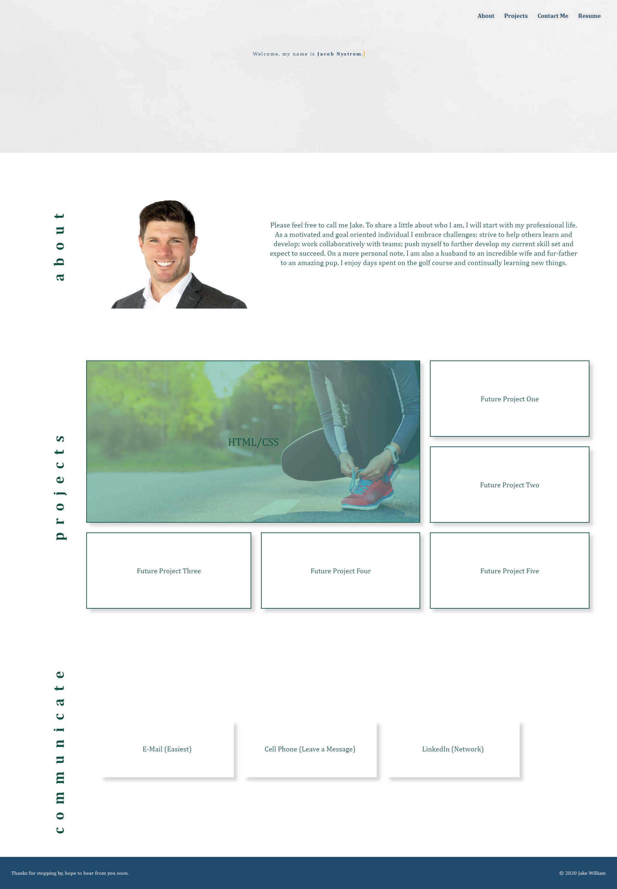

# Jake William - Portfolio

Welcome to my portfolio. Here you will find a few different key components. You will be greated with an animated intro that guides to you either use the navigation menu at the top of the page or manually working your way down the page. In short, I will introduce myself and follow up with a few examples of the work I have done through my time exploring full stack development. You will be left with my contact information in the event you'd like to reach out directly.

## Skils

While building this portfolio several different techniques were used. The end user will encounter both HTML and advanced CSS, such as flexbox, CSS Grid Layout, Media Queryies and CSS variables. 

## User Experience

As an aspiring developer, I hope that the end user will find themselves impressed with a simple desgin that eloquently outlines who I am as an individual. I intend to create a smooth transition between where the viewer is greeted through providing my contact information in a way they will easily understand.

### Task List
-[x] About Me Article
-[x] Project Section
-[x] Contact Me Section
-[x] Resume Link
-[x] Use of Flexboxes
-[x] Use of Grid layouts
-[x] Use of CSS variables
-[x] Use of Media Queries
    **Note: Media queries have been implemented, but additional queries need to be added for even smaller screen sizes.
-[] Add complete resume
-[x] End user presented with name, recent photo and links to sections about me, my work and how to contact me
-[x] The links properly scroll to the corresponding section
-[x] The UI present the viewer with my first application
-[x] When the viewer clicks on the application, they are taken to that deployed application
-[x] The page resizes based on various screens and devices and am provided with a responsive layout

# Snapshot
